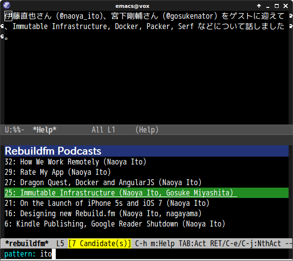

# rebuildfm.el

A Emacs client of [rebuild.fm](http://rebuild.fm/).

## Screenshot

## Requirements

* Emacs 24 or higher(`libxml` support should be enabled).
* [helm](https://github.com/emacs-helm/helm)
* [cl-lib](http://elpa.gnu.org/packages/cl-lib.html)(For Emacs 24.1, Emacs 24.2 users)
* [avplay](https://libav.org/avplay.html) or [ffplay](http://www.ffmpeg.org/ffplay.html)

## Actions

* Play podcast
* Browse podcast page

## Persistent Action

* Display podcast summary

## Basic Usage

#### `rebuildfm`

List Podcast list with helm interface

#### `rebuildfm-stop`

Stop playing MP3 player

## Customization

#### `rebuildfm-mp3-player`

A player for playing mp3 file. Now only `avplay` and `ffplay` are supported.

## See Also

- [http://rebuild.fm/](http://rebuild.fm/)
